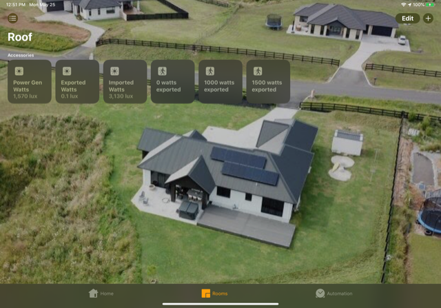

<p align="center">


</p>

# Homebridge-Solax Platform Plugin

Use this plugin to monitor your Solax Inverter. It can provide realtime metrics from your inverter along with configurable alerts for Automation purposes.

Note: HomeKit doesn't natively support a solar inverter or a watts based acccessory. To work around this limitation, a light sensor accessory is used the display the various metrics. Noting the minimum allowed value for a light sensor is 0.1.



Requires the installation of the Solax Monitoring Dongle, and usage of a static IP address on your LAN. Refer to your Router configuration guide on how to do this.

Once you know the IP address of your Solax Inverter, navigate to http://{InverterIpAddress}/api/realTimeData.htm
Here you should get a (malformed) JSON payload, but this will confirm it's possible to extract metrics from it.

## Installation

### Install Plugin

```
npm install homebridge-solax
```

### Configure

```
    "platforms": [
      {
        "platform" : "SolaxHomebridgePlugin",
        "name" : "Solax Inverter",
        "address": "http://192.168.1.40",
        "pollingFrequencySeconds": 60,
        "movingAverageHistoryLength": 10,
        "exportAlertThresholds": [-5000, 0, 1000, 1500],
        "showStrings": true,
        "hasBattery": false,
        "valueStrategy": "SimpleMovingAverage"
      }
    ]
```

**address**: The base hostname of your inverter connection dongle

**pollingFrequencySeconds**: _Optional_: Specifies how often to poll the Solax Inverter, and issue updates to HomeKit.

**movingAverageHistoryLength**: _Optional_: Specifies the number of samples to keep when using Averaging over time based value strategies. See valueStrategy

**exportAlertThresholds**: _Optional_: Array of integers specifying the thresholds to create Alerts for. This will activate a motion trigger when the power export matches or exceeds the threshold value. Example: [-1000, 500, 2000] will create three motion sensors - "1000 watts imported", "500 watts exported" and "2000 watts exported".

**showStrings**: _Optional_: Defaults to true. Shows Individual Inverter String metrics (PV1, PV2).

**hasBattery**: _Optional_: Defaults to true. Experimental. Shows Battery information. Note, due to limited documentaiton from Solax, the Charging State is estimated based on the delta of Battery Watts.

**valueStrategy**: _Optional_: Defaults to SimpleMovingAverage. LatestReading = use the latest values at each polling period, SimpleMovingAverage for providing some smoothing of values, to handle scenarios like sporadic cloud/sun moments. Averages over the entire history. ExpoentialMovingAverage = Use standard Exponential Moving Average calculation to provide a smoothed last value. Refer to movingAverageHistoryLength for Moving Average based history tuning.

**exposeRawMetrics**: _Optional_: Defaults to true. 3 additional accessories will be exposed to provide the raw value feed (no averaging based filtering).

### Leveraging in Automations via Motion Sensor Accessories

You can then create Automations in HomeKit as a result of the motion detection events (or them ceasing to happen).
Example: If 2000 watts or more is being exported, and heatpump isn't already cranked, then bump the temperature up.
